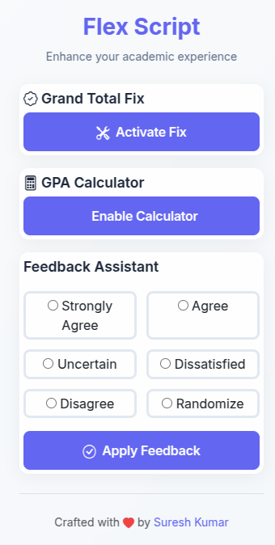
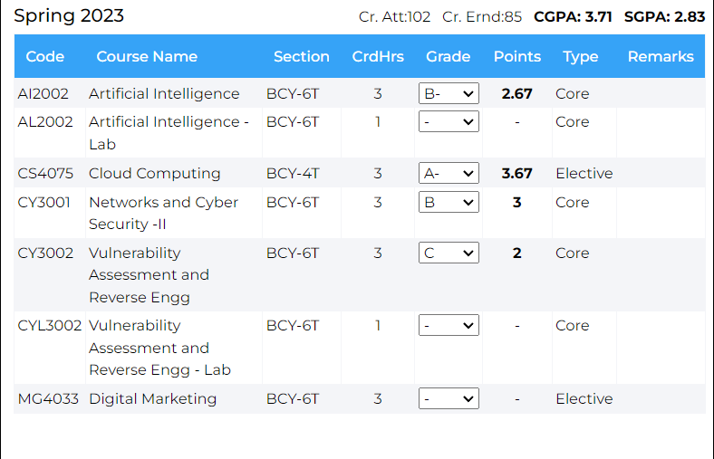

# Flex-Script 

## 🎓 Enhance Your Academic Experience

**Flex-Script** is a **Browser extension** designed to enhance your experience on the **Flex Student Portal**. It allows you to:

- View your **Grand Total Marks**
- Select **feedback** with a single click
- Calculate **SGPA** (current semester) and update **CGPA**
---
🔧 **Contributions** and **recommendations** are welcome!

---

## 🚀 Tech Stack
```bash
| Frontend        | Backend     | Tools & Libraries  |
|-----------------|-------------|--------------------|
| JavaScript      | None        | Chrome Extension   |
| HTML/CSS        |             | Webpack            |
| Browser API     |             | Babel              |
```
---

## 🛠 Installation Procedure

### 1️⃣ Clone the repository

```bash
git clone https://github.com/sureshbarach2001/Scripto-Flex.git
cd flex-script
```
### 2️⃣ Unzip the folder
If you downloaded the zip version, unzip it.

### 3️⃣ Enable Developer Mode
Go to Browser://extensions/.
Toggle Developer Mode on (top-right corner).
### 4️⃣ Load the extension
Click Load unpacked.
Select the unzipped folder.
Your extension is now installed and ready to use! 🎉

## 📝 Usage
### 🔢 Extension
Go to the Extension page.

Click the extension icon in the Chrome toolbar.

Hit Fix Grand Total Marks.

Boom! Your marks are updated.

<p align="center">
  
</p>

Note: Only Total Marks are precise. Other statistics (average, min, max) are estimates.

### 📝 Feedback
Visit the Feedback page.

Click the extension icon.

Choose the desired feedback option.

Hit Select.

Boom! Instant feedback update. 🎯

### 📊 GPA Calculator
Visit the Transcript page.

Click the extension icon.

Click Turn on GPA Calculator.

Update grades.

Boom! Your GPA is now calculated. 📈

<p align="center">
  
</p>

## ⚠ Disclaimer
This code is provided for educational purposes only. The author takes no responsibility for misuse of the code. Use at your own risk. It’s not intended for malicious use or unauthorized access.

### 📝 License
This project is licensed under the MIT License - see the [LICENSE](LICENSE) file for details.

### 📂 Tags
**#flexscript #chromeextension #broswerextension #gpa #feedback**

**#sgpa #marks #cgpa #webextension #education #studentportal**

## 📣 Contributors
Your Name - Creator & Maintainer

Create Your own branch and submit pull request if any improvement.

Feel free to open issues and pull requests for improvements! 🙌

### ✨ Features
Grand Total Marks Calculation - Automatically fixes total marks.

Feedback Selection - One-click feedback update.

GPA Calculation - Track and calculate your GPA based on estimated grades.

Admit Card - Instantly retrieve admit card details.

### 💬 Feedback & Contributions
Contributions are always welcome! If you have suggestions or improvements, feel free to open an issue or submit a pull request. Let’s improve this tool together! 😄

# 📢 Contact
For any inquiries, feel free to reach out to me via:

Email: saink4831@gmail.com

🎉 Thank You for Using Flex-Script!

Made with ❤️ for Flex Student Portal users. Happy learning! 📚


This `README.md` now has a more professional and visually appealing layout that enhances readability and user engagement. Let me know if you'd like further adjustments!

## Disclaimer
This code is provided for educational purposes only. The code is not intended to be used for malicious purposes or to gain unauthorized access to any system. The author of this code takes no responsibility for any misuse of the code. Use at your own risk. 
